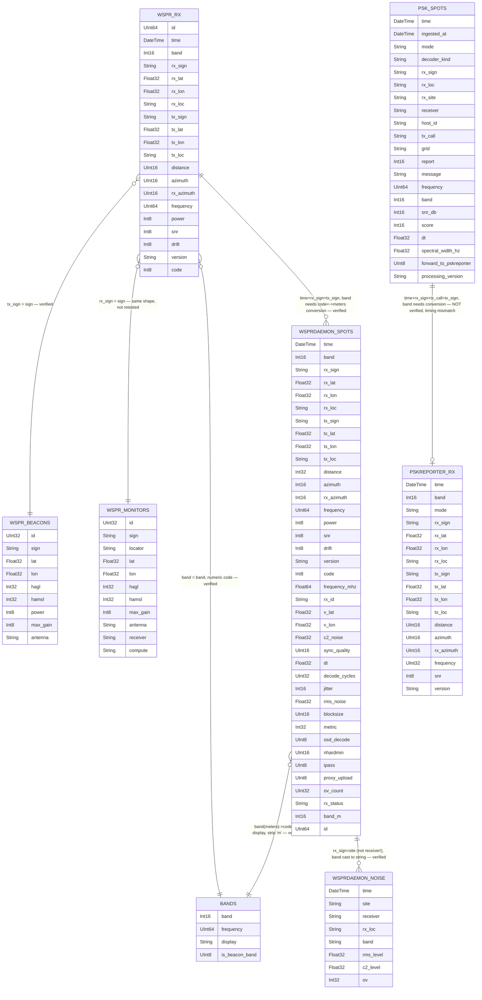

# WSPR database schema diagram

Companion to `20260809_wspr_database_schema_notes.md` — that file has the full verified column types, engines, and prose explanation of each join; this file is just the visual.

## What this kind of diagram is called

A picture of tables-as-boxes-of-columns with lines connecting the columns used to combine them is an **Entity-Relationship Diagram (ERD)**, drawn in **crow's-foot notation** (the forked line-ends encode one/many cardinality).
That's the standard term whether or not the underlying database actually enforces the relationships with real foreign keys.

Since ClickHouse has no foreign-key constraints at all (see the notes file), the relationship lines below are more precisely a **logical ERD**: they show joins that make sense and were verified to return real matching rows, not constraints the database enforces.
A *physical* ERD, by contrast, would only show relationships backed by actual `FOREIGN KEY` declarations — this database has none, so a physical ERD of it would be just eight disconnected boxes.

## Entity → real table mapping

Column types below are simplified (e.g. `LowCardinality(String)` → `String`, `Nullable(Int16)` → `Int16`) — see the notes file for exact ClickHouse types.

| Diagram entity | Real table | Where it exists |
|---|---|---|
| `WSPR_RX` | `wspr.rx` | db1.wspr.live, wd1, wd2 (identical columns) |
| `WSPR_BEACONS` | `wspr.beacons` | db1.wspr.live only |
| `WSPR_MONITORS` | `wspr.monitors` | db1.wspr.live only |
| `BANDS` | `wspr.bands` / `wsprdaemon.bands` | db1.wspr.live (`wspr.bands`) and wd2 (`wsprdaemon.bands`) — **not on wd1** |
| `WSPRDAEMON_SPOTS` | `wsprdaemon.spots` | wd1, wd2 (minor drift — see notes file) |
| `WSPRDAEMON_NOISE` | `wsprdaemon.noise` | wd1, wd2 |
| `PSK_SPOTS` | `psk.spots` | wd1, wd2 |
| `PSKREPORTER_RX` | `pskreporter.rx` | wd1 only |

## Diagram

## Reading the crow's-foot symbols

- `||` — exactly one
- `o{` / `}o` — zero or many
- `o|` — zero or one

## The one thing this diagram can't show cleanly

Mermaid draws relationship lines edge-to-edge between whole boxes, not from one specific column's text to another's — so the line between `WSPR_RX` and `WSPRDAEMON_SPOTS` doesn't visually pin to `time`/`rx_sign`/`tx_sign` the way a hand-drawn diagram might.
The relationship label carries that detail as text instead.
The full join SQL for every line above (including the `band` conversion, which is the part most likely to trip someone up) is in `20260809_wspr_database_schema_notes.md`, under "Example cross-table join queries."
